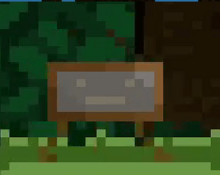
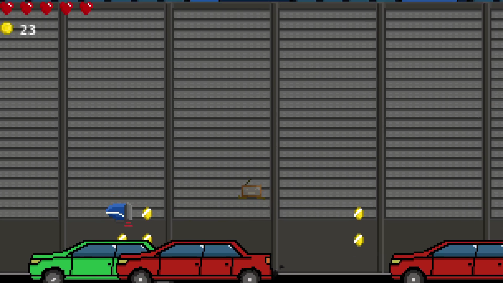
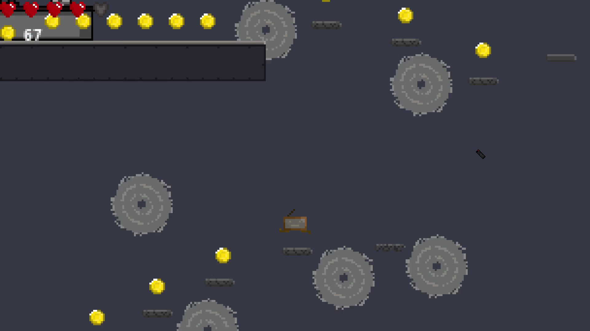
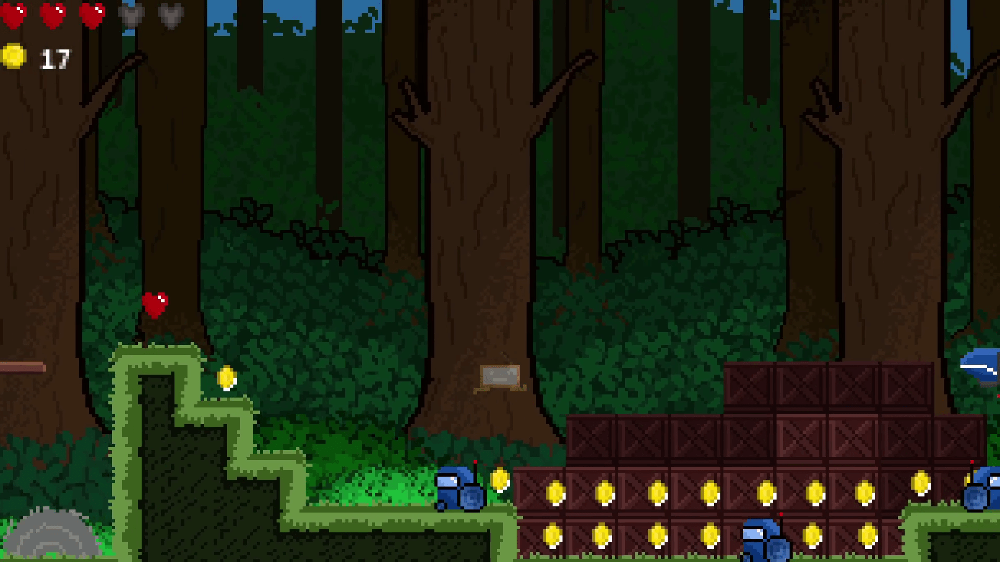

# TV-Adventure

Welcome to TV-Adventure, a 2D pixel art platformer game developed in Godot. In this quirky adventure, you'll take control of a living TV set as it explores a world full of challenges and obstacles. Enjoy the nostalgia of pixel art graphics while hopping and dodging your way through various levels

## Introduction

TV-Adventure is a fun, "casual" platformer where you play as a TV that has come to life. Your goal is to navigate through different levels, avoiding dangers, collecting coins, and reaching the end of each stage.

## License

This project is licensed under the MIT License. Feel free to use, modify, and distribute the code as long as you give proper attribution to the original creator.